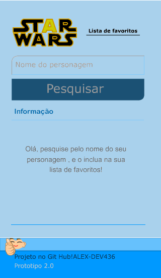

# Protótipo da Interface (UI)

Este documento apresenta o **protótipo visual da aplicação**, criado
como parte do processo de concepção e validação da interface do usuário.

O objetivo do protótipo não é apenas estética, mas **testar fluxo,
organização visual e usabilidade** antes (e durante) a implementação
do código.

---

## Visão Geral

O protótipo representa a interface principal da aplicação,
onde o usuário pode:

- Pesquisar personagens da saga Star Wars
- Visualizar informações retornadas da API
- Cadastrar personagens na lista de favoritos
- Acessar a lista de favoritos

---

## Protótipo – Versão 1.0

> Protótipo criado manualmente e evoluído ao longo do desenvolvimento,
servindo como referência visual para a implementação em React.

---

## Observações de Design

- Interface simples e direta, priorizando clareza
- Componentes organizados de forma vertical para melhor leitura
- Hierarquia visual clara (logo → busca → ação → informação)
- Design pensado para fácil adaptação futura (responsividade e refino visual)

---

## Evolução

Este protótipo **não é definitivo**.

Ele será refinado conforme:
- evolução da aplicação
- melhoria de layout
- ajustes de usabilidade
- aprimoramento visual do GIF e dos componentes

Versões futuras poderão ser adicionadas neste mesmo diretório,
mantendo o histórico de evolução visual do projeto.
