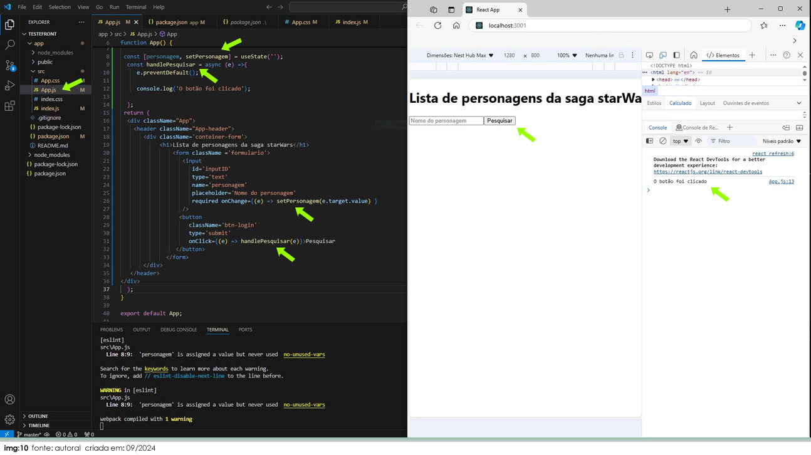

# Processo de Desenvolvimento e Validação

Este documento registra a evolução do projeto de forma incremental, validando cada etapa antes de avançar para a próxima (Front-End ⇄ Back-End ⇄ API externa).

---

## 1) Testes de introdução às tecnologias

### 1.1 Teste de clique no botão (evento no React)

Os testes são importantes quando estamos conhecendo uma nova tecnologia.  
Para este teste, criamos uma **Arrow Function** chamada `cliqueNoBotao`, adicionamos um `console.log("O botão foi clicado")` e chamamos a função no clique do botão, validando a resposta no console do navegador.

```js
function App() {
  const cliqueNoBotao = async (e) => {
    e.preventDefault();
    console.log("O botão foi clicado");
  };

  return (
    <div className="App">
      <header className="App-header">
        <div>
          <h2>
            Lista de personagens <br /> da saga starWars
          </h2>

          <form>
            <input
              id="inputID"
              type="text"
              name="personagem"
              placeholder="Nome do personagem"
              required
            />

            <button type="submit" onClick={(e) => cliqueNoBotao(e)}>
              Testar clique
            </button>
          </form>
        </div>
      </header>
    </div>
  );
}
```
Resultado:



1.2 Utilizando Axios no React

No projeto React, no arquivo App.js, adicionamos o Axios e testamos uma requisição GET para o servidor local.

```js
import "./App.css";
import axios from "axios";

function App() {
  axios
    .get("http://localhost:3000/")
    .then((response) => {
      const retorno = response.data;
      console.log(retorno);
    })
    .catch((error) => console.log(error))
    .finally("");

  return null;
}
export default App;

No Back-End, no arquivo serve.js, criamos uma rota simples para responder a requisição.

const express = require("express");
const app = express();
app.use(express.json());

const cors = require("cors");
app.use(cors());

app.get("/", (req, res) => {
  res.send("Resposta do servidor");
});

app.listen(3000, () => {
  console.log("Servidor rodando");
});
```

1.3 Criar uma base de dados local para ser consumida por nossa API

No Back-End (arquivo serve.js), criamos um objeto simples para simular uma base de dados inicial.
```js
const express = require("express");
const app = express();
app.use(express.json());

const cors = require("cors");
app.use(cors());

const dados = {
  Nome: "Luke Skywalker",
  Altura: "172",
  Peso: "77",
  Cabelo: "loiro",
  "Cor da pele": "branca",
  Olhos: "azul",
  gênero: "masculino",
};

app.get("/", (req, res) => {
  res.send(dados);
});

app.listen(3000, () => {
  console.log("Servidor rodando");
});
```

1.4 Consumir a base de dados no Front-End (React)

No Front-End (arquivo App.js), consumimos o objeto retornado pelo Back-End e exibimos o resultado no console.

```js
import "./App.css";
import axios from "axios";

function App() {
  axios
    .get("http://localhost:3000/")
    .then((response) => {
      const retorno = response.data;
      console.log(retorno);
    })
    .catch((error) => console.log(error))
    .finally("");

  return null;
}
export default App;
```

1.5 Uso de try/catch (teste de erro controlado)

Neste teste, simulei um erro para forçar a exibição da mensagem "Usando Catch e try".

Desafio: descubra o erro (dica: nome de variável).
Simule outros erros, teste respostas com status e brinque com as possibilidades.

```js
const express = require("express");
const app = express();
app.use(express.json());

const cors = require("cors");
app.use(cors());

const dado = {
  Nome: "Luke Skywalker",
  Altura: "172",
  Peso: "77",
  Cabelo: "loiro",
  "Cor da pele": "branca",
  Olhos: "azul",
  gênero: "masculino",
};

app.get("/", (req, res) => {
  try {
    res.send(dados);
  } catch {
    res.send("Usando Catch e try");
  }
});

app.listen(3000, () => {
  console.log("Servidor rodando");
});

1.6 Teste de acesso à API da Star Wars (SWAPI)

Aqui testamos o consumo direto da API externa via Back-End.

const express = require("express");
const app = express();
app.use(express.json());

const cors = require("cors");
app.use(cors());

const axios = require("axios");

app.get("/", async (req, res) => {
  const response = await axios("https://swapi.dev/api/people/");
  try {
    res.send(response.data);
  } catch {
    res.send("Usando Catch e try");
  }
});

app.listen(3000, () => {
  console.log("Servidor rodando");
});
```

## 2) Arquitetura e objetivo

Após a instalação dos aplicativos e bibliotecas necessárias, iniciamos a definição da arquitetura básica do projeto, separando claramente as responsabilidades entre **Back-End** e **Front-End**.

---

#### 🔹 Back-End

- Servidor configurado com *listener* ativo na **porta 3000**
- Responsável por receber, processar e responder requisições HTTP
- Etapa validada com testes diretos no navegador e chamadas à API

Exemplo de validação:

http://localhost:3000


---

#### 🔹 Front-End

- Aplicação React inicializada na porta padrão
- Interface validada no navegador
- Preparada para consumir dados provenientes da API desenvolvida no Back-End

---

### 🎯 Objetivo do projeto

O desafio central desta aplicação consiste em:

- Buscar um personagem pelo nome em uma **API externa (SWAPI)**
- Encaminhar a requisição por meio de uma **API própria (Back-End)**
- Retornar ao Front-End os dados do personagem
- Permitir o **cadastro do personagem** em uma lista de favoritos
- Permitir a **consulta da lista de favoritos** pela interface

---

### 🧩 Estrutura conceitual da solução

Aplicando o princípio de **dividir para conquistar**, o projeto foi organizado em camadas independentes:

- **API dedicada no Back-End**  
  Responsável por intermediar o consumo da API externa

- **Servidores configurados e em execução**  
  Garantindo fluxo contínuo de dados

- **Front-End desacoplado**  
  Focado exclusivamente na experiência do usuário e apresentação das informações

---

#### ✔ Resultado esperado

Essa abordagem facilita:

- Entendimento da arquitetura  
- Manutenção do código  
- Evolução futura do projeto


Com essa base estabelecida, o próximo passo foi integrar as camadas, garantindo a comunicação consistente entre Front-End e Back-End.

## 3) Testes de endpoints (SWAPI)

3.1 Primeiro teste: /people/ (listar recursos por página)

```js
const express = require("express");
const app = express();
app.use(express.json());

const cors = require("cors");
app.use(cors());

const axios = require("axios");

app.get("/", async (req, res) => {
  const { data } = await axios("https://swapi.dev/api/people/");
  return res.json(data);
});

app.listen(3000, () => {
  console.log("Servidor rodando");
});
```

Resultado: colocar imagem


3.2 Segundo teste: /people/1 (recurso específico)

```js
const express = require("express");
const app = express();
app.use(express.json());

const cors = require("cors");
app.use(cors());

const axios = require("axios");

app.get("/", async (req, res) => {
  const { data } = await axios("https://swapi.dev/api/people/1");
  return res.json(data);
});

app.listen(3000, () => {
  console.log("Servidor rodando");
});
```

Resultado: colocar imagem


Observação: quando retornamos data.films, recebemos um array de URLs dos filmes.

3.3 Terceiro teste: retornar somente results

```js
const express = require("express");
const app = express();
app.use(express.json());

const cors = require("cors");
app.use(cors());

const axios = require("axios");

app.get("/", async (req, res) => {
  const { data } = await axios("https://swapi.dev/api/people/");
  return res.json(data.results);
});

app.listen(3000, () => {
  console.log("Servidor rodando");
});
```

Resultado: colocar imagem

3.4 Tipos retornados (typeof)

```js
const express = require("express");
const app = express();
app.use(express.json());

const cors = require("cors");
app.use(cors());

const axios = require("axios");

app.get("/", async (req, res) => {
  const { data } = await axios("https://swapi.dev/api/people/1");
  console.log(typeof data.films);
  return res.json(data.films);
});

app.listen(3000, () => {
  console.log("Servidor rodando");
});
```

O resultado aparece no console quando atualizamos o navegador.

4) Consumindo a API externa através do Back-End e exibindo no Front-End
4.1 Back-End: proxy simples para SWAPI

```js
const express = require("express");
const app = express();
app.use(express.json());

const cors = require("cors");
app.use(cors());

const axios = require("axios");

app.get("/", async (req, res) => {
  let response = await axios("https://swapi.dev/api/people/1");
  try {
    res.send(response.data);
  } catch {}
});

app.listen(3000, () => {
  console.log("Servidor rodando");
});
```

4.2 Front-End: buscar no Back-End e logar resposta

```js
function App() {
  function buscaApi() {
    axios
      .get("http://localhost:3000/")
      .then((response) => console.log(response.data))
      .catch((error) => console.log(error))
      .finally(console.log("dentro do finally"));
  }

  return (
    <div className="App">
      <header className="App-header">
        <div>
          <h2>Busque dados na API</h2>
          <form>
            <input id="inputID" required />
            <button type="submit" onClick={(e) => buscaApi(e)}>
              Pesquisar
            </button>
          </form>
        </div>
      </header>
    </div>
  );
}
export default App;
```

5) Testes de desenvolvimento
5.1 Pesquisa pelo nome (Front-End → Back-End)

Back-End (serve.js): receber JSON via POST e responder com texto.

```js
const express = require("express");
const app = express();
app.use(express.json());

const cors = require("cors");
app.use(cors());

app.post("/", (req, res) => {
  const { personagem } = req.body;
  res.send(`O personagem pesquisado é:${personagem}`);
});

app.listen(3000, () => {
  console.log("Servidor rodando");
});

Front-End (App.js): enviar o nome usando useState.

import "./App.css";
import { useState } from "react";
import axios from "axios";

function App() {
  const [personagem, setPersonagem] = useState("");

  const handlePesquisar = async (e) => {
    e.preventDefault();
    const response = await axios.post(
      "http://localhost:3000/",
      JSON.stringify({ personagem }),
      { headers: { "Content-Type": "application/json" } }
    );
    console.log(response);
  };

  return (
    <div className="App">
      <header className="App-header">
        <div className="conteiner-form">
          <div className="adic_favoritos">
            <a href="*">Lista de Favoritos</a>
          </div>

          <h2>Busque seu personagem</h2>

          <form className="formulario">
            <input
              id="inputID"
              type="text"
              name="personagem"
              placeholder="Nome do personagem"
              required
              onChange={(e) => setPersonagem(e.target.value)}
            />

            <button className="btn-login" type="submit" onClick={handlePesquisar}>
              Pesquisar
            </button>
          </form>
        </div>
      </header>
    </div>
  );
}
export default App;
```

Nota: neste projeto o useState será bastante utilizado.


6) Tratamento de erro (personagem não localizado)
6.1 Back-End: validar retorno da SWAPI

Dentro do trecho onde você obtém users:

```js
if (users != undefined) {
  res.send(users);
} else {
  res.send("Personagem não localizado");
}
```

6.2 Front-End: exibir mensagem sem crashar

Crie variáveis de estado:

const [semPersonagem, setSemPersonagem] = useState("");
let [estiloSemPersonagem, setEstiloSemPersonagem] = useState("none");
let visivelSemPersonagem = { display: `${estiloSemPersonagem}` };

Atualize a função buscaApi:

```js
function buscaApi() {
  axios
    .get(`http://localhost:3000/${pg}`)
    .then((response) => {
      let users = response.data;

      if (users != "Personagem não localizado") {
        setNome(users.name);
        setFilmes(users.films);
        setEstiloPersonagem("block");
        setEstiloInformacao("none");
        setEstiloListaPersonagem("none");
        setEstiloSemPersonagem("none");
      } else {
        setEstiloInformacao("none");
        setEstiloListaPersonagem("none");
        setEstiloCadastro("none");
        setEstiloPersonagem("none");
        setEstiloSemPersonagem("block");
        setSemPersonagem(users);
      }
    })
    .catch((error) => console.log(error))
    .finally("");
}
```

E abaixo do formulário:
```js
<div style={visivelSemPersonagem} className="semPersona">
  Resposta<hr />
  {semPersonagem}
</div>
```

7) Próximo desafio
Exibir nomes dos filmes (e não as URLs)

No estágio atual, a SWAPI retorna URLs em films.
O próximo passo é fazer uma requisição para cada URL de filme e substituir as URLs por títulos, exibindo as informações de forma amigável na interface.

Próxima etapa: normalização do retorno + múltiplas requisições + melhoria da UI.


